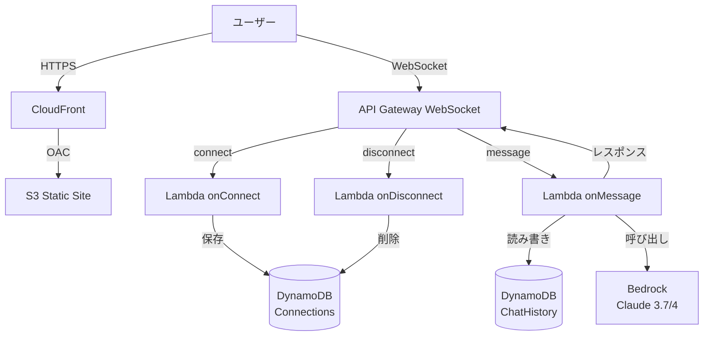

# コスト最適化版 生成 AI チャットアプリケーション設計書

## プロジェクト概要

- **プロジェクト名**: my-llm-app
- **目的**: AWS Lambda + Bedrock を用いたリアルタイム生成 AI チャットアプリ
- **コスト方針**: AWS 無料枠を最大限活用し、個人開発レベルで運用可能な低コスト設計
- **主要機能**: チャット履歴保存、ユーザー認証なし、Claude 3.7 Sonnet/Sonnet 4 対応

## システム構成

### アーキテクチャ図



### 使用サービスと役割

| サービス                  | 役割                       | コスト最適化ポイント             |
| ------------------------- | -------------------------- | -------------------------------- |
| **S3**                    | フロントエンドホスティング | 静的サイトホスティングで無料枠内 |
| **CloudFront**            | CDN・SSL 終端              | PriceClass 100 でコスト削減      |
| **API Gateway WebSocket** | リアルタイム通信           | WebSocket API は REST より安価   |
| **Lambda**                | バックエンド処理           | 128MB メモリで最小コスト         |
| **DynamoDB**              | データ永続化               | オンデマンド課金・TTL 設定       |
| **Bedrock**               | AI モデル呼び出し          | 使用料のみ（個人利用で少量）     |

## データ設計

### DynamoDB テーブル設計

#### 1. Connections テーブル

- **用途**: WebSocket 接続管理
- **構造**:
  ```json
  {
    "connectionId": "string", // パーティションキー
    "expireAt": 1234567890, // TTL (24時間後)
    "createdAt": 1234567890 // 作成日時
  }
  ```

#### 2. ChatHistory テーブル

- **用途**: チャット履歴保存
- **構造**:
  ```json
  {
    "sessionId": "string", // パーティションキー (connectionId)
    "timestamp": 1234567890, // ソートキー
    "role": "user|assistant", // メッセージ種別
    "content": "string", // メッセージ内容
    "model": "claude-3-7-sonnet", // 使用モデル
    "expireAt": 1234567890 // TTL (7日後)
  }
  ```

### メッセージフロー

#### 接続時

1. ユーザーが WebSocket 接続
2. Lambda onConnect 実行
3. connectionId を Connections テーブルに保存（TTL 付き）

#### メッセージ送受信

1. ユーザーがメッセージ送信
2. Lambda onMessage 実行
3. 履歴を ChatHistory テーブルから取得
4. Bedrock API を呼び出し（履歴含む）
5. ストリーミングレスポンスを処理
6. 各チャンクをユーザーに送信
7. 新しい履歴を保存（TTL 付き）

#### 切断時

1. ユーザーが接続切断
2. Lambda onDisconnect 実行
3. connectionId を Connections テーブルから削除

## Lambda 関数設計

### 1. onConnect 関数

- **メモリ**: 128MB（最小）
- **タイムアウト**: 3 秒
- **処理内容**:
  - connectionId の保存
  - TTL 設定（24 時間後自動削除）

### 2. onMessage 関数

- **メモリ**: 512MB（Bedrock SDK のため）
- **タイムアウト**: 30 秒
- **処理内容**:
  - メッセージ受信
  - 履歴取得
  - Bedrock 呼び出し
  - ストリーミングレスポンス処理
  - 履歴保存

### 3. onDisconnect 関数

- **メモリ**: 128MB（最小）
- **タイムアウト**: 3 秒
- **処理内容**:
  - connectionId の削除

## フロントエンド設計

### 技術スタック

- **HTML5**: 基本的な構造
- **Vanilla JavaScript**: 外部ライブラリ不使用
- **WebSocket API**: ブラウザ標準 API
- **CSS3**: シンプルなスタイリング

### ファイル構成

```
frontend/
├── index.html          # チャットUI
├── css/
│   └── style.css       # 最小限のスタイル
└── js/
    └── app.js          # WebSocket処理
```

### 主要機能

- リアルタイムメッセージ表示
- ストリーミングレスポンス対応
- ローカルストレージでの簡易履歴表示
- レスポンシブデザイン

## セキュリティ設計

### 最小限のセキュリティ

- **S3**: CloudFront OAC によるアクセス制限
- **API Gateway**: 現時点では認証なし（後から追加可能）
- **Lambda**: 最小権限 IAM ロール
- **DynamoDB**: Lambda からのみアクセス
- **通信**: HTTPS/WSS 強制

### データ保護

- DynamoDB: 暗号化有効（デフォルト）
- CloudFront: HTTPS 強制
- WebSocket: WSS（Secure WebSocket）

## コスト見積もり

### 月額費用（個人利用想定）

| サービス        | 無料枠           | 超過時費用             | 想定月額     |
| --------------- | ---------------- | ---------------------- | ------------ |
| **Lambda**      | 100 万回         | $0.20/100 万回         | $0.20        |
| **API Gateway** | 100 万メッセージ | $1.00/100 万メッセージ | $1.00        |
| **DynamoDB**    | 25GB             | $0.25/GB               | $0.50        |
| **S3**          | 5GB              | $0.023/GB              | $0.10        |
| **CloudFront**  | 1TB              | $0.085/GB              | $0.50        |
| **合計**        | -                | -                      | **$2.30/月** |

### Bedrock 使用料（別途）

- **Claude 3.7 Sonnet**:
  - 入力: $3.00/1M トークン
  - 出力: $15.00/1M トークン
- **個人利用例**: 月 1000 回会話で約$5-10

## プロジェクト構成

```
my-llm-app/
├── documents/
│   └── 設計書_v1.md    # 本ドキュメント
├── src/
│   ├── on_connect.py   # 接続処理Lambda
│   ├── on_message.py   # メッセージ処理Lambda
│   └── on_disconnect.py # 切断処理Lambda
├── lambda/             # Lambdaデプロイ用パッケージ
├── frontend/
│   ├── index.html
│   ├── css/
│   │   └── style.css
│   └── js/
│       └── app.js
├── cloudformation/
│   └── template.yaml   # CloudFormationテンプレート
└── README.md          # セットアップ手順
```

## 次のステップ

1. CloudFormation テンプレート作成
2. Lambda 関数実装
3. フロントエンド実装
4. デプロイ手順書作成
5. 動作確認

## 拡張可能性

将来的に追加可能な機能：

- **ユーザー認証**: Amazon Cognito 統合
- **ファイル添付**: S3 アップロード機能
- **音声入力**: Amazon Transcribe 統合
- **多言語対応**: Amazon Translate 統合
- **分析機能**: CloudWatch Logs Insights
